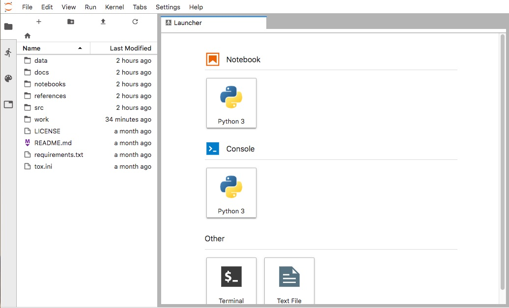
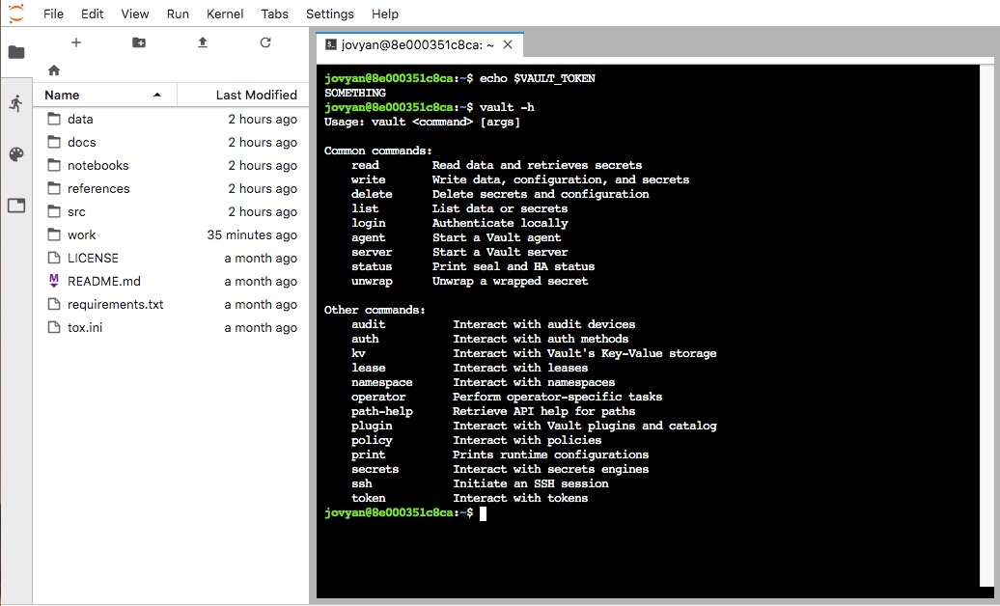

# Steps to start the docker

### Build a docker image

```shell
$ docker build . -t dockerized-pinb-vault
```

### Run the docker container

```shell
$ docker run --rm -p 8888:8888 -e VAULT_TOKEN=SOMETHING -v "$PWD:/home/jovyan/work" dockerized-pinb-vault start.sh jupyter lab
```
### Access to jupyter 

Open the url with you favorite browser
```shell
URL: http://localhost:8888/?token=ca9a828393cb12896a38a7e98a53915159d99f2af6bffc31
```
Note: You can find the token in the docker message log



You can use the system environment variable provided by the docker command line
  


  


